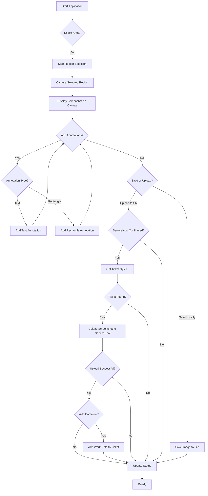
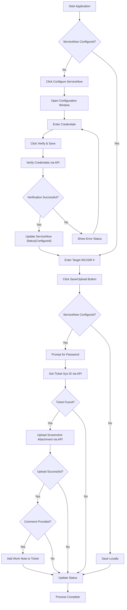

# SOC Screenshot & Annotation Tool

This tool is designed to significantly improve the efficiency of cyber security analysts when working on incidents. By providing a quick and easy way to capture relevant screen regions, annotate them with important details, and directly upload them as attachments and work notes to ServiceNow Incidents or SIRs, analysts can save valuable time and ensure accurate documentation during incident response.

Built with Tkinter for the GUI and Pillow for image manipulation, this desktop application streamlines the process of gathering visual evidence and updating tickets, allowing analysts to focus more on the investigation itself.

## Features

*   **Efficient Screen Capture:** Quickly select and capture specific areas of your screen.
*   **Annotation Tools:** Add text and rectangle annotations with customizable appearance to highlight key information.
*   **Undo/Redo:** Easily correct mistakes with comprehensive undo and redo functionality.
*   **Flexible Saving:** Save annotated screenshots locally to a designated incident folder or any chosen location.
*   **ServiceNow Integration:** Seamlessly look up Incidents/SIRs, upload screenshots as attachments, and add work notes directly from the application.

## Usage

1.  **Start the application:** Run `python app.py`.
2.  **Select Area:** Click the "Select Area" button to capture a region of your screen. The application window will minimize, and you can drag a rectangle over the area you want to capture.
3.  **Annotate:**
    *   Choose "Text" or "Rectangle" mode from the radio buttons.
    *   Select a color from the dropdown and a size (for text) or width (for rectangles).
    *   For Text: Enter your text in the entry box and click on the screenshot where you want to place it.
    *   For Rectangle: Click and drag on the screenshot to draw a rectangle.
    *   Use "Select" mode to click and drag existing annotations to move them on the canvas.
    *   Use the "Undo" and "Redo" buttons to manage your annotation history.
4.  **ServiceNow Configuration (Optional):**
    *   Click the "Configure ServiceNow" button.
    *   In the configuration window, enter your ServiceNow instance URL and username.
    *   Enter your password for verification purposes only.
    *   Click "Verify & Save". The application will attempt to verify the credentials with your ServiceNow instance. The status label will indicate if the configuration was successful.
5.  **Save or Upload:**
    *   If ServiceNow is configured, the "Save" button's text will change to "Upload to SN".
    *   Enter the target INC or SIR number in the "Target INC/SIR #" field.
    *   Add any relevant comments or work notes in the "Comment/Work Note" text area.
    *   Click "Upload to SN". For security, you will be prompted to re-enter your ServiceNow password for the API call. The annotated screenshot will be uploaded as an attachment to the specified ticket, and the content of the comment box will be added as a work note.
    *   If ServiceNow is not configured, clicking the button (labeled "Save") will prompt you to choose a local save location for the annotated screenshot. If a local incident folder is set (via the "New Incident (Local Folder)" button), it will save there automatically without prompting.
6.  **New Incident (Local Folder):** Click this button to create a new local folder within the application's directory to organize screenshots related to a specific incident. Subsequent local saves will default to this folder.

## Project Structure and Files

The project is organized into the following files and directories:

*   `app.py`: This is the main entry point of the application. It contains the primary GUI structure, handles user interactions, and orchestrates calls to the other modules for specific functionalities.
*   `src/`: This directory contains the core logic modules of the application.
    *   `src/config_window.py`: Contains the `ConfigWindow` class, which provides the graphical interface and logic for configuring ServiceNow connection details and verifying credentials.
    *   `src/servicenow_api.py`: Houses functions for interacting with the ServiceNow API, including looking up ticket information, uploading attachments, and adding work notes. These functions are designed to be called by the main application logic.
    *   `src/screenshot_logic.py`: Contains the core logic for capturing screen regions, handling image manipulation (displaying and drawing annotations), managing annotation data, and implementing undo/redo functionality.
*   `docs/`: This directory contains documentation files, including the workflow diagrams.
    *   `docs/application_flow.md`: A Markdown file containing a Mermaid flowchart illustrating the overall application workflow.
    *   `docs/servicenow_integration_flow.md`: A Markdown file containing a Mermaid flowchart detailing the ServiceNow integration process.
*   `Readme.md`: This file, which you are currently reading, provides an overview of the project, setup and usage instructions, file explanations, security details, and contribution guidelines.
*   `.gitignore`: Specifies intentionally untracked files that Git should ignore, such as temporary files, build artifacts, and sensitive information.

## Security Implementations

Handling sensitive credentials like ServiceNow passwords requires careful consideration. In this tool, the following security measures have been implemented:

*   **No Long-Term Password Storage:** The ServiceNow password entered in the configuration window is **not** stored persistently within the application's state or configuration files. It is only used temporarily during the verification process when you click "Verify & Save".
*   **Password Prompt for API Calls:** When you choose to upload a screenshot to ServiceNow, the application will explicitly prompt you to re-enter your password for that specific API call. This ensures that the password is not held in memory for extended periods and requires active user input for each upload operation.
*   **Separation of Concerns:** By separating the ServiceNow API interaction logic into `servicenow_api.py`, the core application logic in `app.py` does not directly handle the sensitive password beyond passing it to the API functions when explicitly provided by the user.
*   **.gitignore:** The `.gitignore` file is configured to exclude common sensitive files (like `.env` if you were to use environment variables for configuration) and the local incident folder where screenshots are saved, preventing their accidental inclusion in version control.

**Note:** While these measures enhance security compared to hardcoding or persistently storing credentials, for a production environment or enhanced security, consider implementing more robust authentication methods provided by ServiceNow, such as OAuth or API key-based authentication, and managing secrets using secure environment variables or a dedicated secrets management system.

## Workflow Diagrams

### Application Flow

### ServiceNow Integration Flow

